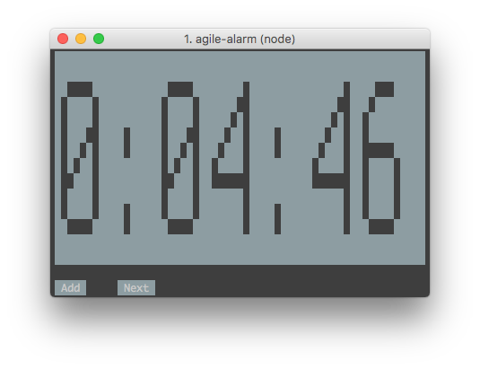

# Agile Alarm



## Install

```
npm i agile-alarm -g
```

## Usage

```
agile-alarm
```

This will open the agile alarm app and start a 5 minute timer. After 5 minutes an air horn will play. Then you have the option to add 2 minutes by clicking add, or clicking next to start another 5 minute timer.
